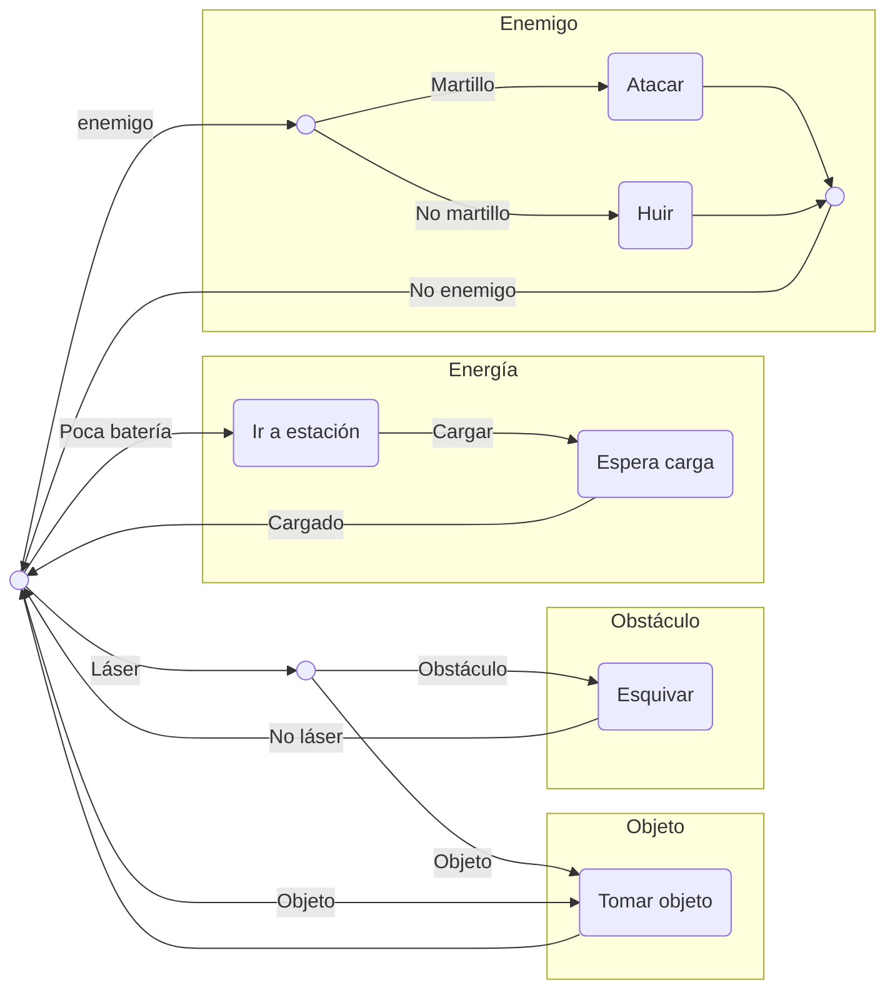

```mermaid

flowchart LR

    %%A(Velocidad constante)
    A(( ))

    subgraph Objeto
        G(Tomar objeto)
    end  
    
    subgraph Obstáculo
        B(Esquivar)
    end

    subgraph Energía
        C(Ir a estación)
        D(Espera carga)
    end

    subgraph Enemigo
        I(( ))
        E(Atacar)
        H(Huir)
        J(( ))
    end


    F(( )) 


    %%subgraph Navegación
    %%    Z
    %%end

     

    %% Conexiones entre subgráficos
    A --> |Láser| F
    F --> |Obstáculo| B
    F --> |Objeto| G
    A --> |Objeto| G
    G --> A
    B --> |No láser| A

    A --> |enemigo| I
    I --> |Martillo| E
    I --> |No martillo| H
    E --> J
    H --> J
    J --> |No enemigo| A

    A --> |Poca batería| C
    C --> |Cargar| D
    D --> |Cargado| A

    %% Estilos opcionales para nodos auxiliares
    %%classDef emptyNode fill:none,stroke:none;
    %%F(( )):::emptyNode
```

